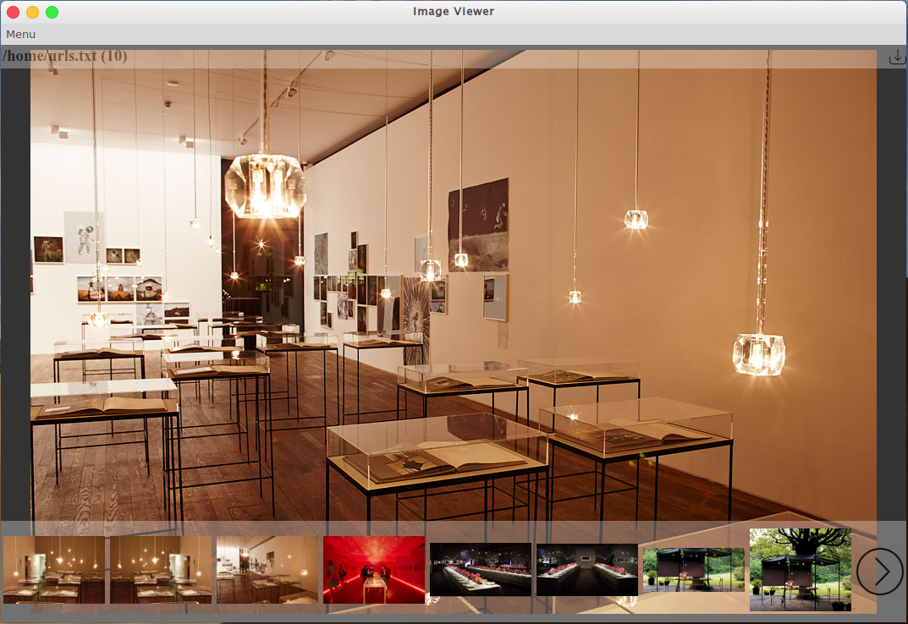

# Image viewer

This image viewer is created based on [electron quick start](https://github.com/electron/electron-quick-start)




# Features
* View images by URLs in text file

# How to use

Assume that you have nodejs and npm installed
```
npm install
npm run start
```
Click 'Menu' => 'Open URL File...' or Ctrl+O to open urls file.
The file should have one image url per line.
